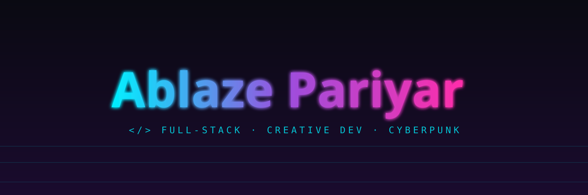

 

 

 

---

## 🚀 About Me

I’m a backend & AI engineer focused on building intelligent, scalable systems powered by automation, cloud infrastructure, and modern AI models.  
My work blends **engineering discipline** with **futuristic design**, creating tools that feel fast, reliable, and ahead of their time.

---

## 🧠 Technical Focus Areas

- **AI Agents & Automation** — LLM workflows, WhatsApp bots, task orchestration  
- **Backend Engineering** — Node.js, TypeScript, FastAPI, REST APIs  
- **Cloud & Infrastructure** — Railway, Azure, Supabase, GitHub Actions  
- **Data & Storage** — PostgreSQL, Supabase  
- **Real‑time Integrations** — Webhooks, WhatsApp Cloud API  

---

## 🔧 Tech Stack

**Languages:**  
TypeScript · Python · Java · JavaScript  

**Backend & APIs:**  
Node.js · Express · FastAPI · REST  

**AI & Tools:**  
Groq · Gemini · DeepSeek · GitHub Copilot  

**Cloud & DevOps:**  
Railway · Azure · Supabase · GitHub Actions  

**Frontend:**  
HTML · CSS  

---

## 🏗️ Projects

### 🤖 WhatsApp AI Agent  
LLM-powered auto-responder using Groq and WhatsApp Cloud API.

### 🌐 AI Knowledge Hub  
Dynamic web app for structured AI content and experimentation.

### 🔐 OpenShield Automation  
Security rule contributions and automation for Azure environments.

### 🧩 Supabase Agent System  
Database-driven logic for automated workflows and agents.

---

## 🧊 Contribution Graph

The contribution animation is generated automatically by the GitHub Actions workflow
and published to the `output` branch.
